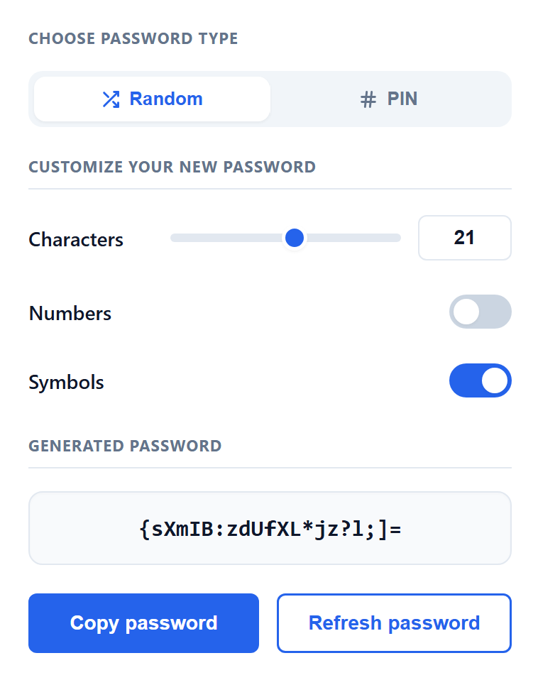

# Pass Maker

A simple Chrome Extension for generating secure random passwords and PINs.

## Features

- Generate random passwords
- Generate numeric PINs
- Customize password length
- Include or exclude numbers
- Include or exclude symbols
- One-click copy to clipboard
- Refresh to generate a new password

## Preview

## Installation

1. Clone this repository.
2. Open **Chrome** and go to `chrome://extensions/`
3. Enable **Developer mode**.
4. Click **Load unpacked**.
5. Select the project folder.

## Usage

1. Open the extension.
2. Choose **Random** or **PIN**.
3. Adjust the settings.
4. Copy the generated password with a single click.

## Technologies

- HTML
- CSS
- JavaScript
- Chrome Extensions API

## License

Apache 2.0
